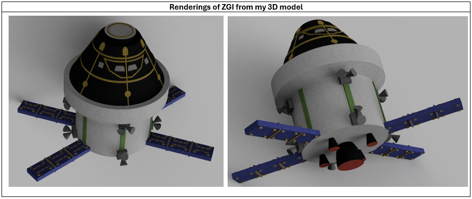
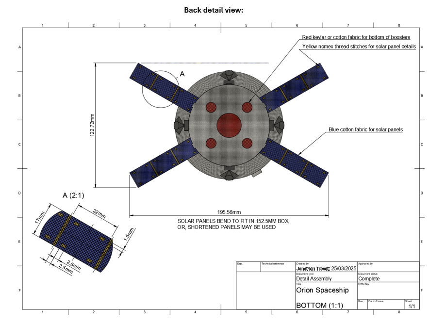
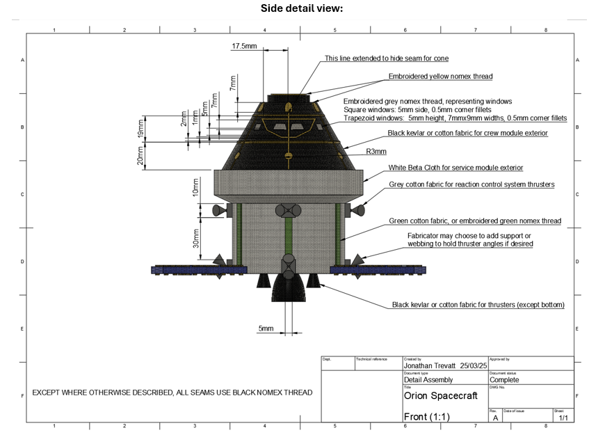
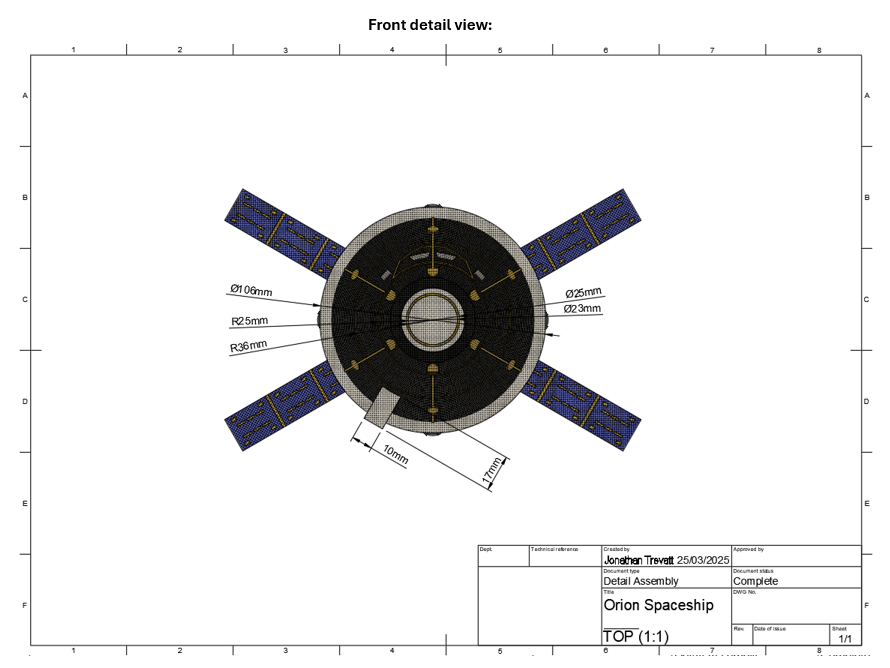
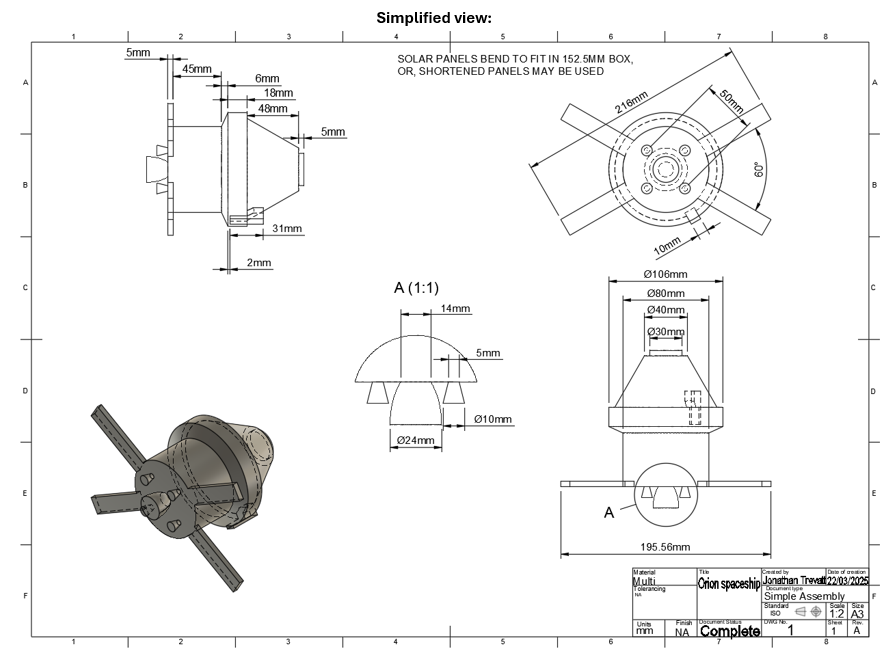

# NASA Freelancer ZGI Design competition

There was a NASA competition on freelancer.com to design the next ZGI (zero gravity indicator) for the Artemis II mission.
The mission will validate the Orion spacecraft and the SLS (space launch system) in preparation for Artemis III, which will see man (and the first woman) return to the moon, and maybe eventually, mars.
A ZGI is a stuffed toy in the capsule that makes it easy for people observing through cameras to see when the spacecraft is in zero gravity conditions.
For my entry, instead of hand-sketching a design, I created a full mock-up 3D model using Autodesk fusion with dimensioning and renders.

### Here is my entry:

**Submission Title:** The Orion
 
**Description of the design:**
  A (stylised) model of the Orion spacecraft. Colours and materials are chosen to maximise contrast. 
Solar panels are intended to be foldable (analogous to on the real spacecraft). 
Details are embroidered, and boosters are stitched to the main body. 
The stitching attaching the solar panels should be substantial so that their base will be solidly attached, and the degree of bend of the tips of the panels would indicate the acceleration. 

**An explanation of why you created the design and why it meets the design requirements:**
My inspiration was to create a detailed spacewoman to ride the spacecraft like the bomb in the classic movie 'Dr. Strangelove'. It was to celebrate the hopefulness and progress of rocket technology and the achievements of the first (to be) woman on the moon by contrasting it with the doomsday themes of the cold war as depicted in the movie. I ran out of time to complete my vision, but perhaps someone else’s spaceman submission could be combined with mine.
The design is attractive and easily recognisable by everyone with an interest in space, regardless of place of birth.

**A description of any motion your ZGI may perform during spaceflight:**
The solar panels should bend down at the tips more as the acceleration increases.
The solar panels and the boosters should jiggle about like bobble heads under vibration.
The entire body would float when under zero gravity conditions, probably bouncing around and rotating.

**An explanation of how your design is meaningful to the Artemis II mission, the Artemis campaign, and/or its significance to exploration and discovery:
The design, being a depiction of the Orion Spacecraft to be used in the Artemis missions, shares the meaning and significance of the spacecraft and the campaign itself. It will validate the SLS and the Orion craft in preparation for humanity returning to the moon, and eventually even further.
We shall reclaim space from the robots!

**Document notes:**
1. I have provided images of both a detailed model, which shows how the finished item is intended to look, and a simplified model, which has embroidered and stitched details removed. This is for the sake of clear dimensioning.
2. Interpretation of the rules: 
The instructions say that the ZGI must fit within a 6” box. The solar panels are intended to fold (like on the real capsule), allowing it to fit. If this is not allowed, measurements can be downscaled by 22%, or the solar panel’s length can be trimmed.

**Design:**

