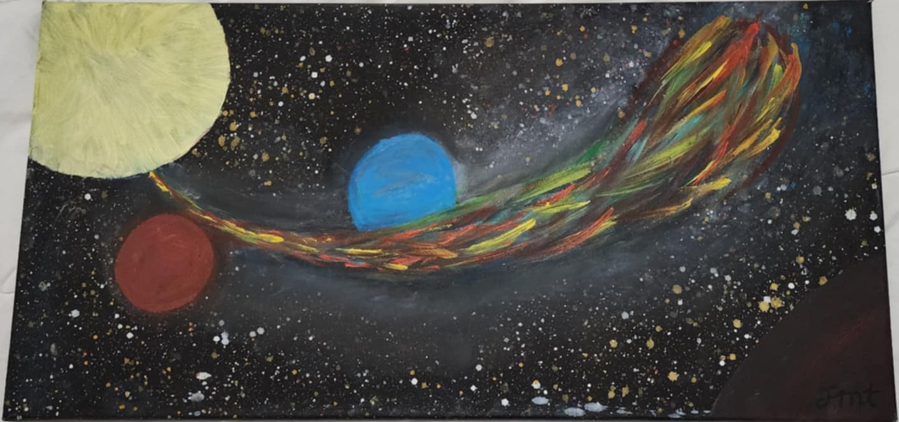

# Other/Miscellaneous

Projects that are not significant enough to have their own section.

## Blacksmithing

Cleaver:

	

Crowbar: (Picture coming soon)

## Leather smithing

I spent some time involved in a LARP (live action role play) group. During this time, I learned how to do some leather work and I crafted a set of tree-themed armour.

	
	
	

## Signature Seal
I first created a design for a wax seal, and got that manufactured.

	
	
	

Later, after I started blacksmithing, I realised that the features of the wax seal design might be too fine for a makers mark. So I made a more robust design for that use.

	

This is designed to have the black parts act as a mask for a chemical etching process.

## Art

### The Coming Comet

## Flag creation
I wanted to create a design for a more unified and inclusive flag for all Australians, and I thought this design looked much cooler than our current design.
The red and black on the right, and the yellow circle are elements from the aboriginal flag. The red is the red earth, the black is the sky, and the yellow circle is the sun.
In this flag, the specific colour of the yellow should be gold #FFCD00 (one of Australia's national colours, representing the golden wattle, Australia's national flower).
There are elements of the current flag as well. The southern cross is present, and the commonwealth star represents the federation of the six Australian states, and the territories.
You may notice elements of each flag "leaking" into each other. The sun partially covers the left, and the stars are on the right. This was to represent the joining of cultures to create something awesome.
It follows the principles of good flag design:
- Meaningful symbolism
- limited colour palettes
- No lettering or seals
- Distinctiveness
- Simplicity 
	- Can be drawn from memory by a child
	- Shapes can be recreated precisely using only geometric scribing tools (compass and ruler)
- Clear lines, no gradients

> Note: This design is not presented here as an appropriate flag to replace the current Australian flag, but rather, just because I personally find it to be aesthetically pleasing. I think that any suitable new flag should not feature the union jack - instead emphasising Australia's unique identity. 

	

## Other
There are other pending projects that I cannot list in detail here yet.  
Watch this space.